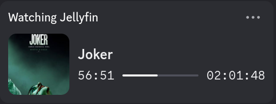
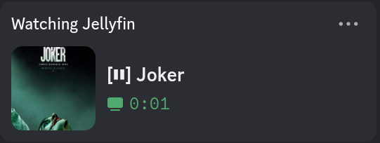
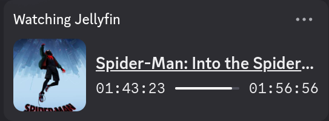
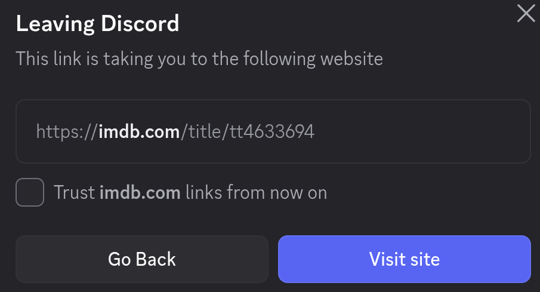
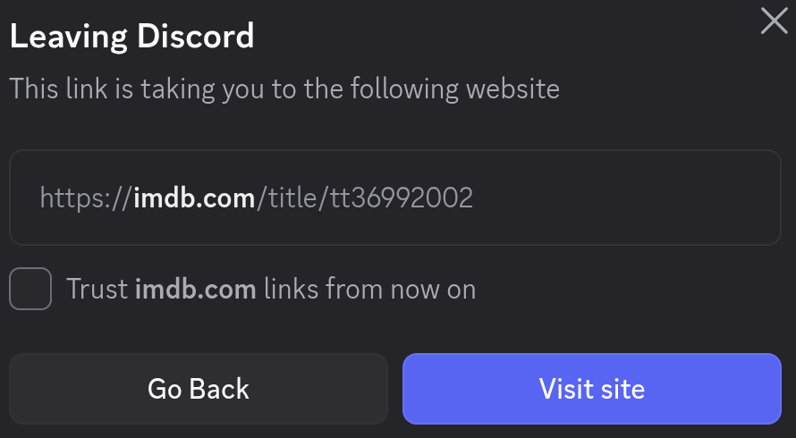
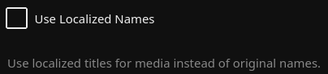
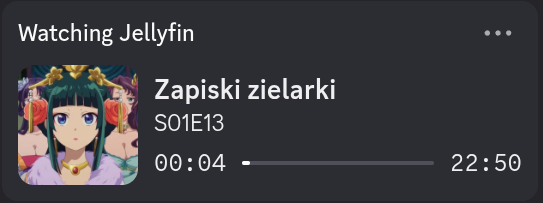

# Jellyfin Server-side Discord RPC
Fully server-side implementation of Discord Rich Presence for Jellyfin media server.

# ⚠️ Important Disclaimer
This plugin utilizes Discord tokens as a way to connect to the [Gateway](https://discord.com/developers/docs/events/gateway) as the user and update the rich presence. While it does not perform any other actions, Discord's ToS prohibits ANY usage of tokens as a way of user automation, also known as self-botting. By using this plugin, you acknowledge the risk associated with using it. I am not responsible for any damage caused to any discord account that may occur. From my experience, the risk is very low but it is not zero.

# Why would you consider using this plugin?
Main reason why you would consider using it is that it is fully server-sided. There is no need to install anything on the clients (excluding a browser or the Jellyfin app). \
This means that no matter what device the user will be watching from, their Discord RPC will be properly updated. \
As mentioned above, there is the risk of using user tokens. If you want a fully ToS-compliant alternative, I recommend checking out the client-sided [jellyfin-rpc](https://github.com/Radiicall/jellyfin-rpc).

# Installation
For installation instructions, see [Installation and Configuration Guide](README/InstallConfigGuide/text.md)

# Showcase
For now the plugin supports only movies and shows. Other media types are planned to be implemented in the future.
### Watching a movie
 \

### Having a movie paused
 \

### Watching a show
 \

### Having a show paused
 \

## Links and Ratings
### Hovering over the image will show the media's community rating if available

### Clicking on the media name will open its IMDb page if available
 \

### When watching a show, clicking on the current season and episode will open its IMDb page if available

## Metadata Languages
The plugin does not fetch metadata from any external source. It is using what Jellyfin is providing. This is why, the config checkbox `Use Localized Names` is for. When enabled, the plugin will use **localized names** (displayed in the user interface) - for me, they are in Polish, as shown below. When disabled, the plugin will use their **original names**, that does not mean they will be in English. \

## Localized name

## Original name

