# Installation and Configuration Guide
This guide will walk you through the steps necessary to install and configure the Jellyfin Server-side Discord RPC plugin. Necessary things involve:
- A Jellyfin media server installation with admin access
- A Discord Application with bot user inside a server
- A text channel within that server where the bot will be able to send messages with images
- A Discord user token for each user you want to have rich presence enabled

### Note on steps involving Discord Application
- Steps 3, 4 and 5 are only necessary if you want to display images in your rich presence. You can skip them if you only want to display text information.
- If you already have your Discord bot inside your server, you can use that one instead of creating a new one. Just make sure it has all necessary permissions and put its token and channel ID into the plugin's configuration.

## Step 1: Jellyfin
Make sure you have a working Jellyfin media server installation. You can find the official installation guide [here](https://jellyfin.org/docs/general/installation/). Plugin was built and tested with Jellyfin version 10.11.3 so having at least that version is recommended.

## Step 2: Install the plugin
TODO

## Step 3: Create a Discord Server with a dedicated text channel
1. Open Discord and create a new server by clicking the `+` button at the bottom of the server list. \
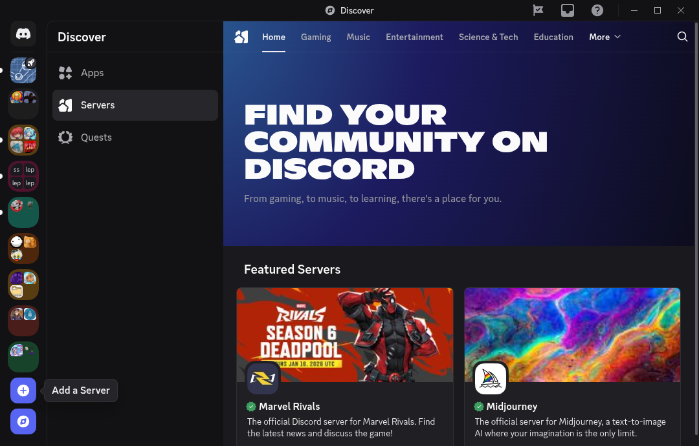
2. Select `Create My Own`. \
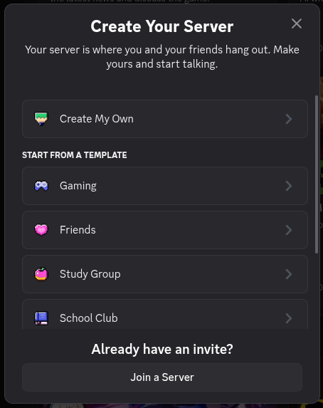
3. Select `For me and my friends` and call it however you want. \
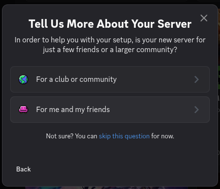
4. Once the server is created, either create a new text channel (by pressing the `+` button next to a category) or select one of the existing ones. It will be used by the bot to convert images to discord-compatible format. Then right-click it and select `Copy Channel ID`. \
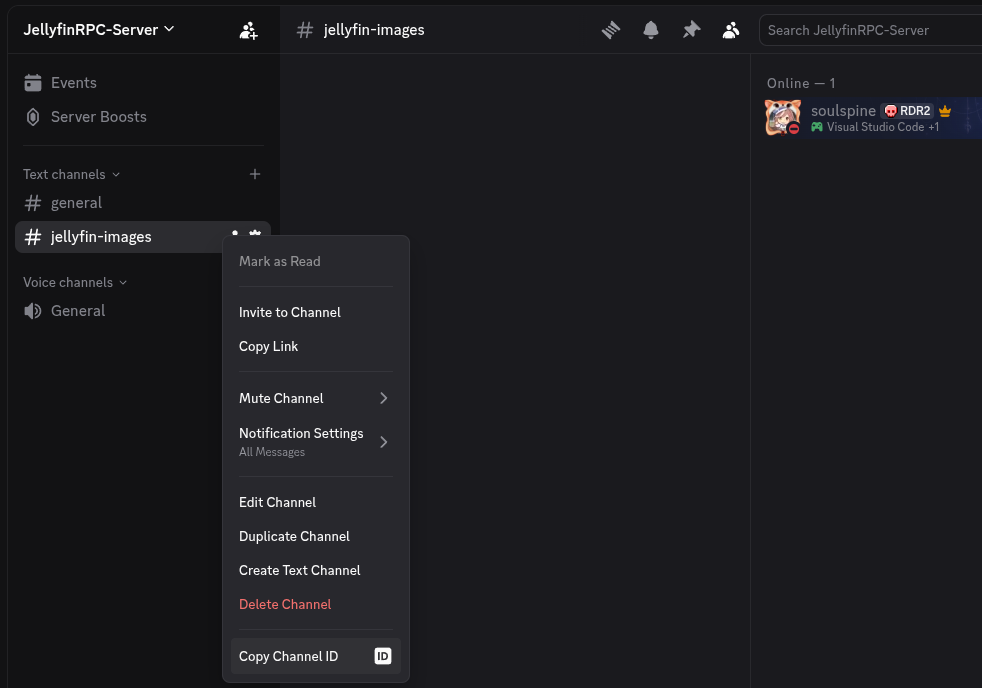
5. Paste the copied Channel ID into the plugin's configuration page under `Discord Image Conversion Channel Id` and press `Save settings`. \
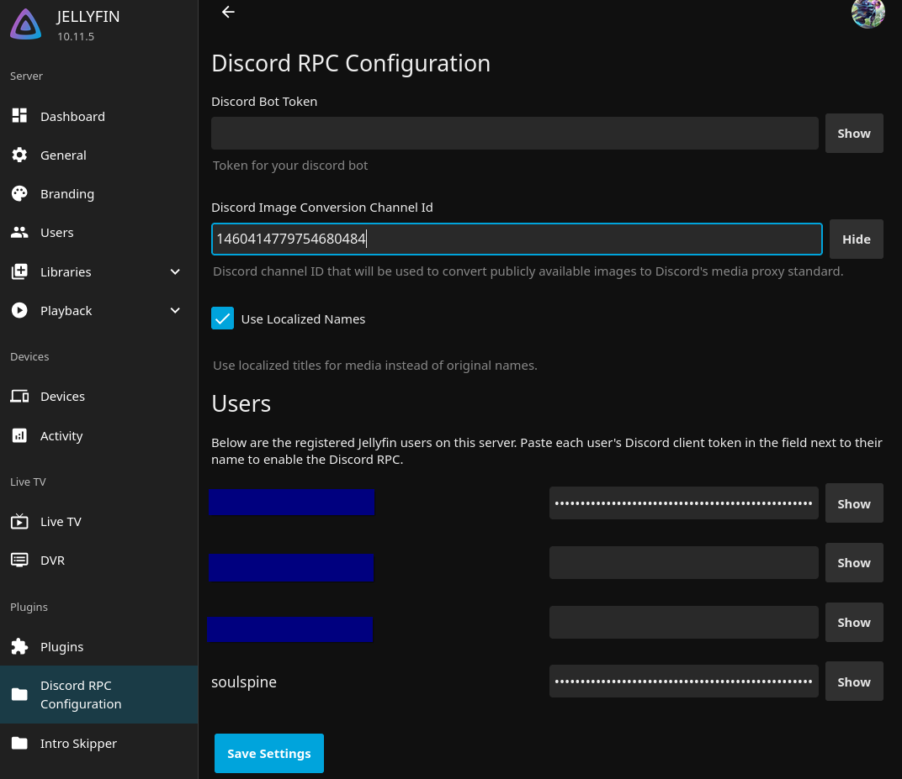

## Step 4: Create a Discord Application
1. Go to the [Discord Developer Portal](https://discord.com/developers/applications) and log in with your Discord account.
2. Create a new application by clicking the `New Application` button and give it a name (it can be anything). 
3. Navigate to the `Installation` tab.
    - We don't need the `User Install` so you can uncheck that box under the `Installation Contexts`.
    - Under `Default Install Settings`, make sure to add the `bot` scope and the `Attach Files` permission.
    - Save changes.

    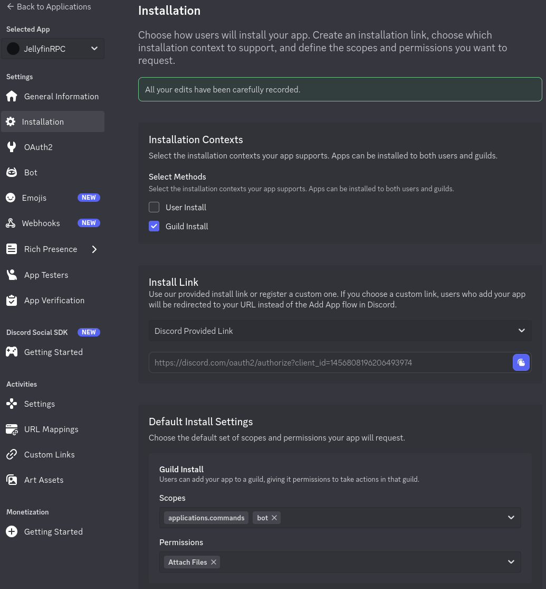
4. Navigate to the `Bot` tab.
    - In there, we need to enable the `Message Content Intent` under the `Privileged Gateway Intents` section.
    - You can also customize the bot's username, icon and banner if you want to.
    - Save changes.

    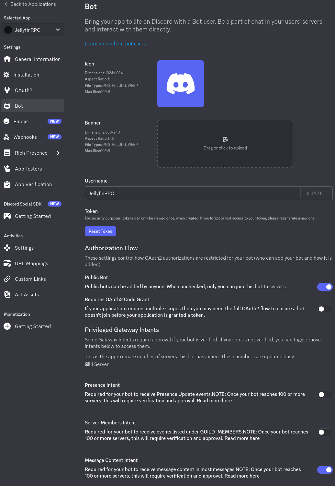
5. While still in the `Bot` tab, find the `Reset Token` button and click it to generate your bot token. Copy it into the plugin's configuration and press `Save settings`. \
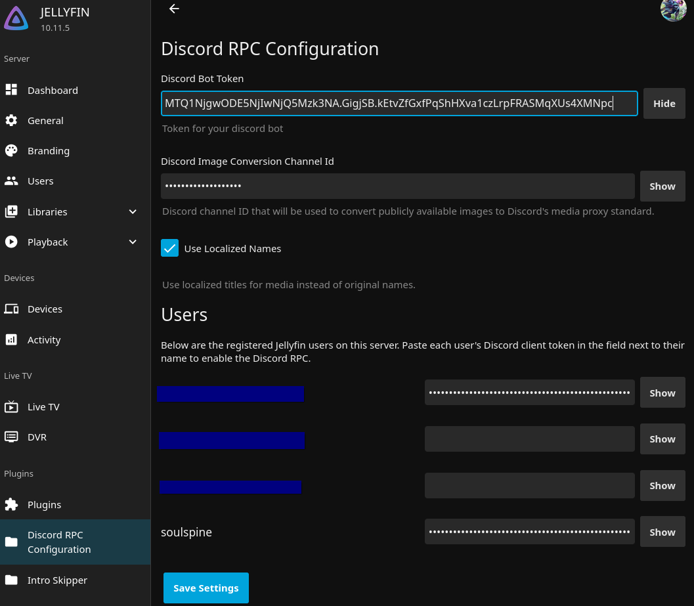

6. Go back to the `Installation` tab and copy the link generated under `Install Link`. We will use it to add the bot to our server.

## Step 5: Adding the bot to the server
1. Go to the link copied in the previous step. It should open a dialog asking you to select a server. Choose your desired server (in this case the one created in Step 3) from the dropdown and press `Continue`. \
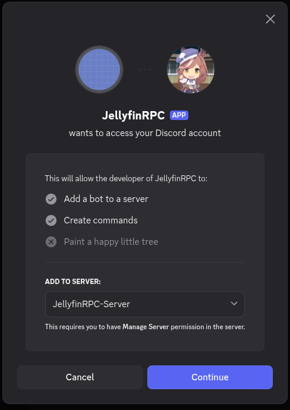
2. On the next page, make sure that the bot has the `Attach Files` permission enabled and press `Authorise`. \
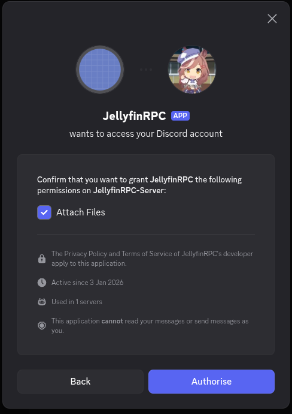

## Step 6: Getting the discord token
1. Open discord in browser (https://discord.com/channels/@me)
2. Open developer tools (F12 or right click -> Inspect) \
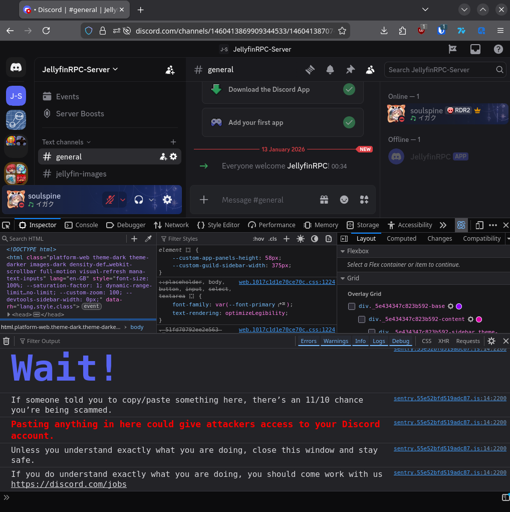
3. Switch to mobile view by clicking the mobile icon (top right corner on firefox based browsers). \
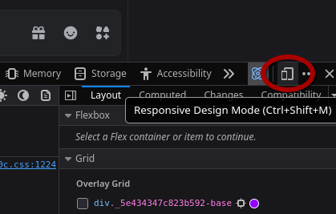
4. Open the `Network`, put `typing` into the filter field and reload the page. \
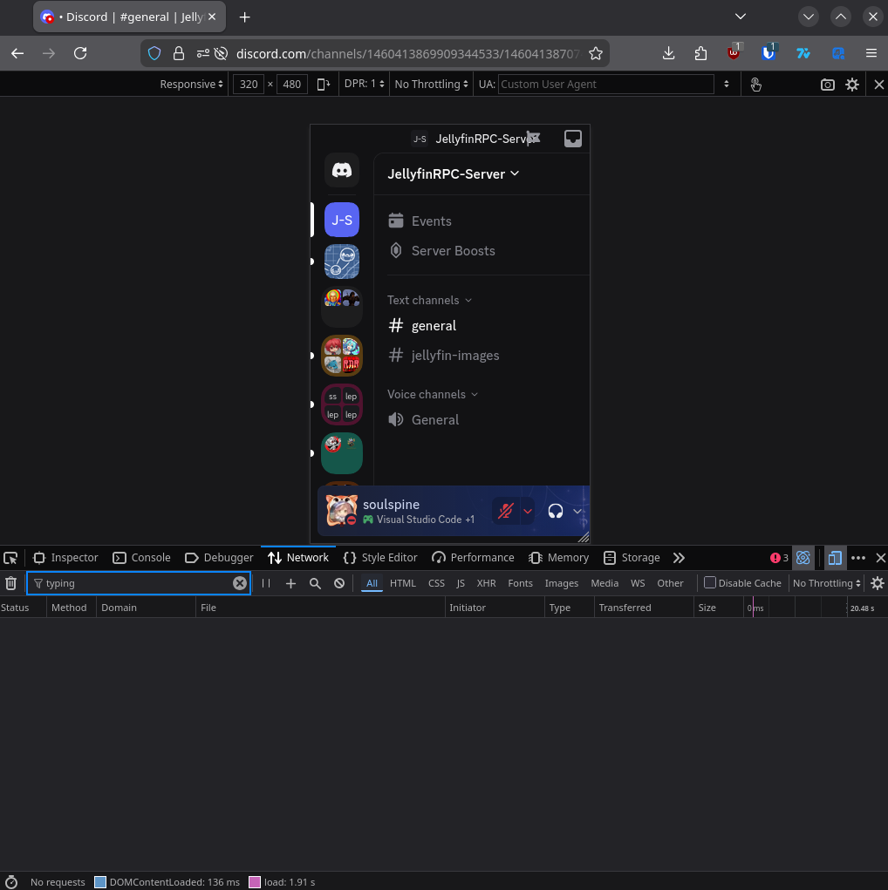
5. Open any text channel and start typing something to trigger a `typing` event. You should see a new entry appear in the network tab. Click it and open the `Headers` tab. There you will find a `Authorization` header containing your token. Copy it and paste it into the plugin's configuration next to desired user's name. Do NOT share this token with anyone else. It allows them to get full access to your Discord account.\
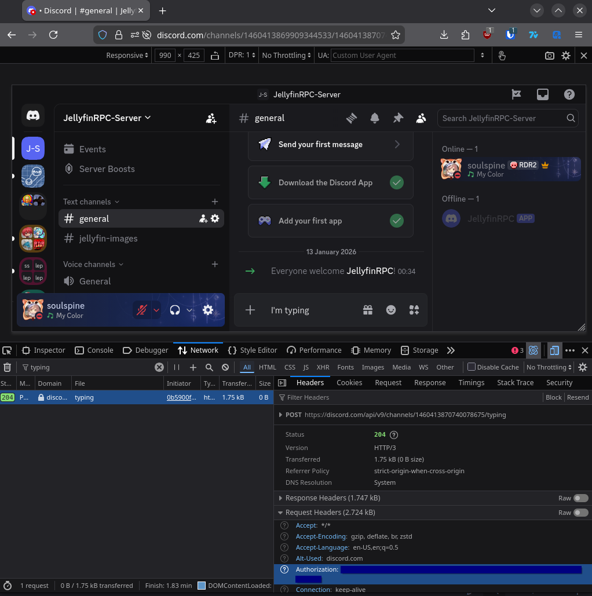

## Step 7: Try it out!
If you followed all the steps correctly, you should be able to reload the plugin and see the bot come online. Then try playing something as the user whose token you put into the configuration and see if the rich presence looks like this: \
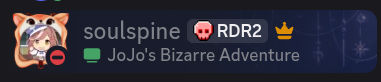 \
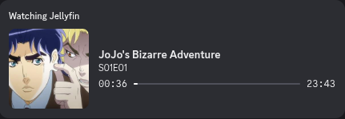